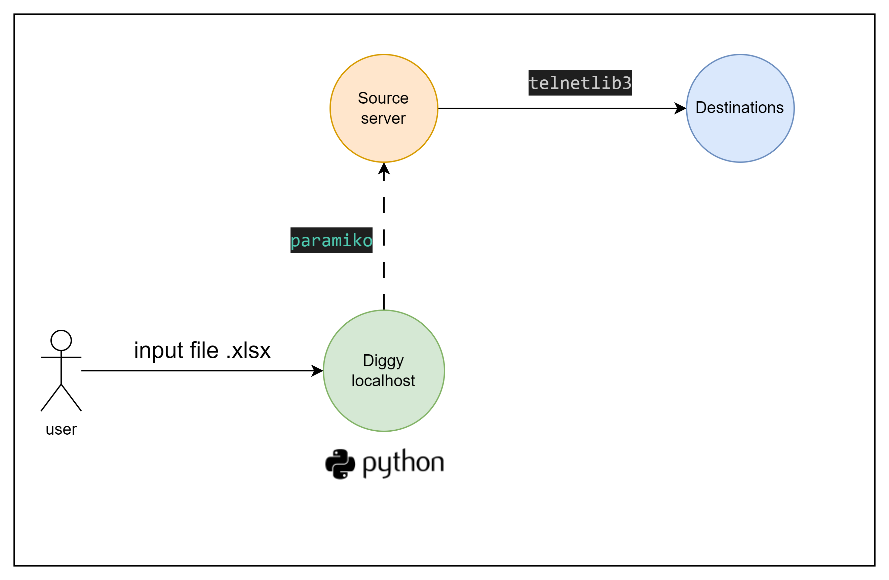

# Diggy Standalone: Network Connectivity Testing Tool


Diggy Standalone is a tool designed to test network connectivity between a group of source servers (SRC) and destination servers through a specified port. It utilizes SSH and Telnet to verify communication capabilities.Destinations Server


## Key Features
- Automated Testing: Simultaneously checks connections across multiple servers using data from an Excel file.
- SSH and Telnet: Employs SSH to access SRC servers and Telnet to test connections to destination servers.
- Excel Reporting: Records test results directly into the original Excel file for convenient analysis.

## Installation and Usage
1. Clone Repository:
```bash
git clone https://github.com/niknew1996/diggy_stand_local.git
cd diggy_stand_local
```
2. Install Python:
- install python from this https://www.python.org/downloads/
3. Create Virtual Environment:
```
pip install virtualenv
python -m venv myenv  # สร้าง virtual environment
source myenv/Scripts/activate  # เปิดใช้งาน virtual environment
```
4. Create Virtual Environment:
```bash
pip install -r requirements.txt
```
5. Prepare Excel File:

Template an Excel (.xlsx) file and fill in the following data:

- Name: Name or description of the test
- Source IP Start: Starting IP of the SRC server group
- Source IP End: Ending IP of the SRC server group
- Destination IP Start: Starting IP of the destination server group
- Destination IP End: Ending IP of the destination server group
- Port: Port to be tested (if left blank, port 80 will be used)
6. Run the Program:
```bash
python test_ssh.py
```
7. Enter Information:

- Filename of Excel: Specify the prepared Excel file name
- SSH Username: Enter SSH username
- SSH Password: Enter SSH password
8. Check Results:

Test results will be recorded in the "Test Result" column of the Excel file:

- Success: All connections were successful
- Failed: At least one connection failed (check the prompt for details)

### Precautions

- This program displays the SSH password on the screen, which may not be secure. Use it in a secure environment or consider improving the password input method for better security.
- Ensure that the Excel file and Python script are in the same directory.
- Please note that this tool uses Telnet, which is a protocol that does not encrypt data. Sending sensitive information over Telnet may be risky.
### Additional Information
- Repository: https://github.com/niknew1996/diggy_stand_local
- Python: https://www.python.org/

If you have any questions or need further assistance, you can contact the developer through the GitHub repository.